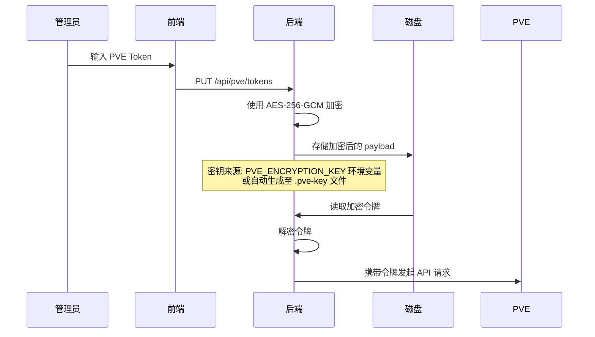

<p align="center">
  <h1 align="center">NanshanNav 🏠</h1>
  <p align="center">家庭网络导航面板 — 自托管的可定制仪表盘</p>
</p>

<p align="center">
  
  
  
  
  
  
</p>

---

## 目录

- [项目简介](#项目简介)
- [核心特性](#核心特性)
- [技术栈](#技术栈)
- [组件生态](#组件生态)
- [快速开始](#快速开始)
- [项目结构](#项目结构)
- [配置说明](#配置说明)
- [部署指南](#部署指南)
- [Docker 部署](#docker-部署)
- [API 接口](#api-接口)
- [后端架构](#后端架构)
- [状态管理](#状态管理)
- [国际化](#国际化)
- [开发指南](#开发指南)
- [常见问题](#常见问题)

---

## 项目简介

**NanshanNav** 是一个面向家庭网络环境的自托管导航仪表盘。它提供了一个可自由拖拽的网格化面板，让你将所有常用的网络工具、监控信息和快捷链接整合到一个页面中。

无论是管理 Proxmox 虚拟化服务器、收藏常用的 Web 工具、查看系统状态，还是快速搜索网络资源，NanshanNav 都能胜任。

### 设计理念

- **自托管优先**：所有数据存储在本地，不依赖任何第三方云服务。面板配置可通过服务端持久化自动跨设备同步。
- **模块化组件**：通过组件注册表（Widget Registry）体系，轻松扩展新功能
- **高度可定制**：自由布局、自定义主题色、多语言支持
- **家庭网络场景驱动**：专为家庭实验室、NAS 用户、自建服务爱好者设计

---

## 核心特性

### 📐 自由网格布局
基于 `react-grid-layout` 的拖拽式网格面板，支持 5 个响应式断点：
- **lg** (≥1200px) — 12 列
- **md** (≥996px) — 10 列
- **sm** (≥768px) — 6 列
- **xs** (≥480px) — 4 列
- **xxs** (<480px) — 2 列

可自由拖拽、缩放组件位置，布局自动适应不同屏幕尺寸。

### 🎨 主题系统
- **三种模式**：浅色 / 深色 / 跟随系统
- **自定义调色盘**：支持分别配置浅色和深色主题下的 19 种 CSS 颜色变量（背景色、文本色、边框色、状态色、强调色等）
- **一键重置**：随时恢复默认配色方案

### 🌐 国际化
内置中文（zh-CN）和英文（en）语言包，支持一键切换。翻译覆盖了应用界面、组件标签和设置选项等所有 UI 文本。

### 📦 数据持久化

仪表盘配置（组件布局、设置、主题）通过双层策略持久化：

1. **本地缓存**：`localStorage` 提供即时加载，首次打开无白屏
2. **服务端存储**：退出编辑模式时自动 `PUT /api/dashboard` 保存到服务端文件 `server/config/dashboard-state.json`；页面加载时自动 `GET /api/dashboard` 拉取最新配置

架构决策：

| 数据层 | 角色 | 存储位置 |
|--------|------|----------|
| 服务端 | **可信源** (source of truth) | `server/config/dashboard-state.json` |
| 浏览器 | **写入缓存** (write-through cache) | `localStorage` (`dashboard-storage`) |

这意味着在同一台电脑配置的面板，换设备打开也会自动加载——只要设备可以访问服务端 API。

#### 编辑模式保护

编辑模式通过 `/admin` 路径访问，并由 Nginx + Authelia 保护。服务端 API（`/api/dashboard`、`/api/pve/*`）也在同一 Authelia 认证域下。

> **设计选择**：`GET /api/dashboard` 是否需要认证由部署者决定。当前配置下 `/api/*` 路径全部受 Authelia 保护，这意味着**未登录用户看到的是默认空白面板**。如果你希望面板对访客可见但编辑受限，可以从 Nginx 配置中将 `GET /api/dashboard` 豁免出 Authelia 保护（详见[常见问题](#如何让面板配置对访客可见)）。

也支持手动导出/导入 JSON 文件作为离线备份方案。

### 🔧 编辑模式
- 通过访问 `/admin` 路径自动进入编辑模式
- 也可通过工具栏按钮手动切换
- 编辑模式下可添加、删除、配置、拖拽组件
- 组件编辑操作栏支持悬停显示，不影响正常浏览

### ⚡ 键盘快捷键
- `Ctrl+K` — 聚焦搜索框（搜索组件启用时）
- 更多快捷键规划中

### 🛡️ 安全性
- **Content Security Policy**：严格的 CSP 头配置
- **加密令牌存储**：PVE API 令牌使用 AES-256-GCM 加密存储
- **文件上传校验**：支持 MIME 类型和魔术字节（Magic Bytes）双重验证
- **输入验证**：URL 合法性校验、代理转发等

---

## 技术栈

### 前端

| 技术 | 用途 |
|------|------|
| **React 19** | UI 框架 |
| **TypeScript 6** | 类型安全 |
| **Vite 8** | 构建工具与开发服务器 |
| **Tailwind CSS 4** | 原子化 CSS 框架 |
| **Zustand 5** | 轻量级状态管理 |
| **react-grid-layout** | 拖拽网格布局 |
| **TanStack React Query** | 服务端数据获取与缓存 |
| **react-router-dom** | 路由管理 |
| **lucide-react** | 图标库 |
| **react-markdown + remark-gfm** | Markdown 渲染 |
| **Vitest + Testing Library** | 单元测试 |

### 后端

| 技术 | 用途 |
|------|------|
| **Hono.js 4** | 轻量级 Web 框架 |
| **@hono/node-server** | Node.js 服务适配 |
| **tsx** | TypeScript 运行时 |
| **Node.js Crypto** | AES-256-GCM 加解密 |

---

## 组件生态

NanshanNav 采用组件注册表（Widget Registry）模式，所有组件统一注册、按需加载。目前已内置 8 种组件：

### 🕐 时钟
- 支持模拟钟表 / 数字时钟两种显示模式
- 可配置时区、日期格式、24/12 小时制
- 支持显示秒数和日期

### 📝 标题
- 可自定义标题级别（h1~h4）
- 支持文本对齐（左/中/右）
- 可选择 Lucide 图标
- 可选显示分割线

### ✍️ Markdown 文本
- 使用 `react-markdown` + `remark-gfm` 渲染
- 支持 GFM（GitHub 风格 Markdown）语法
- 适合显示说明文档、笔记等富文本内容

### 🔗 链接集合
- 可管理多个链接收藏
- 每个链接支持：名称、URL、描述、图标
- 图标来源支持：网站 Favicon、Lucide 图标、自定义上传、首字母
- **健康检查**：可选启用链接可达性检测，在线/离线状态一目了然
- 支持新窗口打开

### 🌐 网页嵌入
- 通过 iframe 嵌入外部网页
- 适合将常用的 Web 管理面板（路由器、NAS 等）集成到仪表盘中

### 🖥️ PVE 状态监控
- 实时监控 Proxmox VE 服务器状态
- 显示指标：CPU 使用率、内存使用率、运行时间、存储使用量
- 显示虚拟机/容器（VM/LXC）的运行和停止数量
- 可配置的刷新间隔（默认 15 秒）
- 通过后端代理转发 API 请求，令牌加密存储

### 🔍 多功能搜索框
- 支持多搜索引擎切换：Google / Baidu / Bing / DuckDuckGo / 自定义
- 自定义搜索引擎 URL 格式
- **本地搜索**：在当前仪表盘页面内搜索组件标题和内容
- Ctrl+K 快捷键快速聚焦

### 🖼️ 图片
- 支持 URL 和本地上传两种来源
- 丰富的显示模式：适应（contain）、裁剪（cover）、填充（fill）、原始大小
- 对齐设置（水平 + 垂直）
- 圆角、阴影效果
- 点击动作支持：无 / 图片预览 / 跳转链接

### 组件注册表（Widget Registry）

所有组件通过 `src/registry/` 统一注册，每个组件定义包含：

```typescript
interface WidgetDefinition {
  kind: WidgetType;              // 组件类型标识
  displayName: string;           // 显示名称
  displayKey?: string;           // i18n 翻译键
  icon: string;                  // 图标名称
  defaultSize: { w: number; h: number };  // 默认网格大小
  minSize?: { w: number; h: number };     // 最小网格大小
  defaultOptions: Record<string, unknown>; // 默认配置
  componentLoader: () => Promise<...>;     // 组件动态加载
  settingsLoader?: () => Promise<...>;     // 设置面板动态加载
  requiresServerData: boolean;   // 是否需要服务端数据
}
```

添加新组件只需在 `src/registry/definitions/` 下创建定义文件并在 `src/registry/index.ts` 中注册即可。

---

## 快速开始

### 前置要求

- **Node.js** ≥ 20.x
- **npm** ≥ 9.x

### 安装与运行

```bash
# 1. 克隆项目
git clone <repository-url>
cd NanshanNav

# 2. 安装依赖
npm install

# 3. （可选）配置环境变量
cp .env.example .env
# 编辑 .env 文件，配置 PVE API Token 等

# 4. 同时启动前后端开发服务器
./start.sh

# 或者分别启动：
npm run dev           # 前端 (Vite, 默认 :5173)
npm run serve:upload  # 后端 (Hono, 默认 :3001)

# 前后端同时启动（使用 concurrently）：
npm run dev:all
```

### 访问

- **仪表盘**：`http://localhost:5173`
- **编辑模式**：`http://localhost:5173/admin`（自动进入编辑模式）
- **后端 API**：`http://localhost:3001`

---

## 项目结构

```
NanshanNav/
├── .env.example                       # 环境变量示例
├── package.json                       # 项目配置与依赖
├── vite.config.ts                     # Vite 构建配置（含 Tailwind、代理）
├── tsconfig.json / tsconfig.app.json  # TypeScript 配置
├── vitest.config.ts                   # 测试配置
├── eslint.config.js                   # ESLint 配置
├── start.sh                           # 一键启动脚本
│
├── index.html                         # SPA 入口 HTML（含暗色模式闪屏防护）
│
├── src/                               # 前端源码
│   ├── main.tsx                       # 应用入口（React Query Provider）
│   ├── App.tsx                        # 根组件（ThemeProvider + I18nProvider）
│   │
│   ├── components/
│   │   ├── layout/
│   │   │   ├── AppLayout.tsx          # 主布局（工具栏 + 侧边栏 + 画布）
│   │   │   ├── DashboardToolbar.tsx   # 顶部工具栏（设置、主题、导入导出等）
│   │   │   ├── Sidebar.tsx            # 组件库侧边栏
│   │   │   └── DashboardCanvas.tsx    # 拖拽网格画布（react-grid-layout）
│   │   │
│   │   ├── widgets/
│   │   │   ├── WidgetCard.tsx         # 组件卡片容器（含 ErrorBoundary）
│   │   │   ├── WidgetShell.tsx        # 组件外壳（编辑控件浮层）
│   │   │   ├── WidgetPalette.tsx      # 组件选择面板
│   │   │   ├── WidgetSettings.tsx     # 组件设置弹出框
│   │   │   ├── WidgetError.tsx        # 组件错误状态
│   │   │   ├── WidgetSkeleton.tsx     # 组件加载骨架屏
│   │   │   ├── ClockWidget/           # 时钟组件
│   │   │   ├── TitleHeaderWidget/     # 标题组件
│   │   │   ├── MarkdownTextWidget/    # Markdown 组件
│   │   │   ├── WebLinkWidget/         # 链接集合组件
│   │   │   ├── WebPageWidget/         # 网页嵌入组件
│   │   │   ├── PveStatusWidget/       # PVE 状态组件
│   │   │   ├── SearchBoxWidget/       # 搜索框组件
│   │   │   └── ImageWidget/           # 图片组件
│   │   │
│   │   ├── common/                    # 通用组件
│   │   │   ├── ThemeToggle.tsx        # 主题切换
│   │   │   ├── ColorThemeEditor.tsx   # 自定义颜色编辑器
│   │   │   ├── GridLinesToggle.tsx    # 网格线切换
│   │   │   └── IconDisplay.tsx        # 图标显示
│   │   │
│   │   └── ui/                        # UI 基础组件
│   │       ├── button.tsx
│   │       ├── input.tsx
│   │       ├── modal.tsx
│   │       ├── select.tsx
│   │       ├── slider.tsx
│   │       └── switch.tsx
│   │
│   ├── store/                         # Zustand 状态管理
│   │   ├── index.ts                   # 合并切片 + persist 中间件
│   │   ├── slices/
│   │   │   ├── settingsSlice.ts       # 仪表盘设置（主题、语言、网格等）
│   │   │   ├── uiSlice.ts            # UI 状态（编辑模式、侧边栏等）
│   │   │   ├── layoutSlice.ts        # 网格布局（5 个断点）
│   │   │   └── widgetSlice.ts        # 组件列表（增删改）
│   │   └── selectors.ts              # 选择器
│   │
│   ├── registry/                      # 组件注册表
│   │   ├── index.ts                   # 注册表聚合
│   │   ├── loaders.ts                 # 组件动态加载器
│   │   └── definitions/              # 各组件定义
│   │       ├── clock.ts
│   │       ├── image.ts
│   │       ├── title-header.ts
│   │       ├── markdown-text.ts
│   │       ├── web-link.ts
│   │       ├── web-page.ts
│   │       ├── pve-status.ts
│   │       └── search-box.ts
│   │
│   ├── types/                         # TypeScript 类型定义
│   │   ├── dashboard.ts               # 仪表盘设置类型
│   │   ├── widget.ts                  # 组件系统类型
│   │   ├── layout.ts                  # 布局类型
│   │   ├── pve.ts                     # PVE API 数据类型
│   │   └── index.ts                   # 聚合导出
│   │
│   ├── hooks/                         # 自定义 Hooks
│   │   ├── useAutoEditMode.ts         # URL 路径自动切换编辑模式
│   │   ├── useKeyboardShortcut.ts     # 全局键盘快捷键
│   │   ├── useElementSize.ts          # DOM 元素尺寸监听
│   │   └── useServerSync.ts           # 服务端面板配置同步
│   │
│   ├── i18n/                          # 国际化
│   │   ├── index.ts
│   │   ├── types.ts                   # 翻译文本类型定义
│   │   ├── useTranslation.tsx         # React Context + Hook
│   │   └── locales/
│   │       ├── zh-CN.ts               # 中文语言包
│   │       └── en.ts                  # 英文语言包
│   │
│   ├── lib/                           # 工具库
│   │   ├── constants.ts               # 常量（断点、搜索引擎等）
│   │   ├── api/
│   │   │   ├── pve.ts                 # PVE API 客户端
│   │   │   ├── favicon.ts             # Favicon 代理客户端
│   │   │   └── link-health.ts         # 链接健康检查
│   │   └── utils/
│   │       ├── generate-id.ts         # 唯一 ID 生成
│   │       ├── format-bytes.ts        # 字节格式化
│   │       └── format-uptime.ts       # 运行时间格式化
│   │
│   ├── styles/
│   │   ├── globals.css                # 全局样式 + CSS 变量（主题）
│   │   └── widgets.css                # 组件相关样式
│   │
│   └── __tests__/                     # 测试
│       ├── components/WidgetShell.test.tsx
│       ├── store/widgetSlice.test.ts
│       └── lib/pve.test.ts
│
├── server/                            # 后端源码
│   ├── index.ts                       # Hono 服务入口（上传、Favicon 代理）
│   ├── routes/
│   │   └── pve-proxy.ts               # PVE API 代理（令牌管理、请求转发）
│   └── lib/
│       ├── crypto.ts                  # AES-256-GCM 加解密
│       └── favicon.ts                 # Favicon 缓存
│
├── dist/                              # 构建产物
├── uploads/                           # 上传文件（含 favicons 缓存）
│
├── nginx.conf.example                 # Nginx 配置示例（含 Authelia 认证）
├── nanshan-nav-backend.service.example  # systemd 后端服务示例
└── nanshan-nav-frontend.service.example # systemd 前端服务示例
```

---

## 配置说明

### 环境变量

| 变量 | 默认值 | 说明 |
|------|--------|------|
| `FRONTEND_PORT` | `5173` | 前端开发服务器端口 |
| `BACKEND_PORT` | `3001` | 后端 API 服务器端口 |
| `PORT` | `3001` | 后端服务监听端口 |
| `UPLOAD_DIR` | `./uploads` | 文件上传目录 |
| `VITE_PVE_API_TOKEN` | — | PVE API 令牌（环境变量回退） |
| `PVE_ENCRYPTION_KEY` | — | 令牌加密密钥（32 字节 hex） |

### PVE 令牌配置

有两种方式配置 Proxmox VE API 令牌：

**方式一：令牌文件（推荐）**

```bash
cp server/config/pve-tokens.example.json server/config/pve-tokens.json
```

编辑 `pve-tokens.json`，支持按主机配置不同令牌：

```json
{
  "default": "monitor@pve!dashboard=YOUR_SECRET",
  "hosts": {
    "pve.lan:8006": "monitor@pve!dashboard=SECRET_FOR_PVE",
    "pve2.lan:8006": "monitor@pve!dashboard=SECRET_FOR_PVE2"
  }
}
```

令牌会自动使用 AES-256-GCM 加密存储，密钥自动生成在 `server/config/.pve-key`。

**方式二：环境变量**

```bash
VITE_PVE_API_TOKEN=monitor@pve!dashboard=YOUR_SECRET
```

### Nginx 部署配置

参考 `nginx.conf.example`，支持：
- Authelia 认证集成
- `/admin` 路径的编辑模式保护
- 上传文件代理与缓存
- PVE API 代理

---

## 部署指南

### 生产构建

```bash
# 构建前端
npm run build

# 产物位于 dist/ 目录
```

### systemd 服务

项目提供了完整的 systemd 服务示例：

**后端服务** (`nanshan-nav-backend.service.example`)：
- 使用 `tsx` 直接运行 TypeScript 后端
- 包含安全加固配置（PrivateTmp、ProtectSystem、NoNewPrivileges 等）
- 自动重启策略

```bash
sudo cp nanshan-nav-backend.service.example /etc/systemd/system/nanshan-nav-backend.service
sudo systemctl daemon-reload
sudo systemctl enable --now nanshan-nav-backend
```

**前端服务** (`nanshan-nav-frontend.service.example`)：
- 支持两种部署方式：
  - **Option A（推荐）**：Nginx 直接托管静态文件
  - **Option B**：Vite preview 模式提供服务

### 反向代理（Nginx）

参考 `nginx.conf.example` 配置反向代理，包含：
- SPA 路由处理（`try_files $uri $uri/ /index.html`）
- `/admin` 路径的 Authelia 认证保护
- 上传文件缓存策略（`expires 30d; Cache-Control: public, immutable`）

---

## 🐳 Docker 部署

> 使用 Docker Compose 一键部署 NanshanNav 完整服务栈（Nginx + Backend + Authelia + Redis）。

### 前置要求

- Docker ≥ 24.x
- Docker Compose ≥ v2.x
- 确保主机 `8080` 端口可用（或修改 `.env` 中 `NGINX_HTTP_PORT`）

### 快速开始

```bash
# 1. 准备环境变量
cp docker/.env.example .env

# 2. 编辑 .env 文件，至少填入以下必填项：
#    - PVE_ENCRYPTION_KEY  (生成: openssl rand -hex 32)
#    - JWT_SECRET          (生成: openssl rand -hex 32)
#    - SESSION_SECRET      (生成: openssl rand -hex 32)
#    - AUTHELIA_PASSWORD   (bcrypt 哈希，生成方式见 .env 注释)

# 3. 生成 Authelia 密码哈希（替换 'your-password' 为你的密码）
docker run --rm ghcr.io/authelia/authelia:4.38 authelia hash-password 'your-password'
# 将输出的哈希值填入 .env 的 AUTHELIA_PASSWORD

# 4. 构建镜像并启动所有服务
# ⏱ 首次构建需要下载依赖和编译前端，约 1-3 分钟
docker compose up -d

# 5. 访问
#    http://localhost:8080       — 仪表盘（无需登录）
#    http://localhost:8080/admin — 编辑模式（需要 Authelia 登录）
```

### 服务架构

```
                          ┌────────────────────────────────────┐
                          │         Nginx (:8080 → :80)        │
                          │   ┌──────────────────────────────┐ │
                          │   │    auth_request → Authelia    │ │
                          │   │    → 认证通过 → 转发到 Backend │ │
                          │   └──────────────────────────────┘ │
                          └──────┬──────────────────┬──────────┘
                                 │                  │
                    ┌────────────┘                  └──────────────┐
                    ▼                                               ▼
          ┌─────────────────────┐                     ┌──────────────────────┐
          │  Backend :3001      │                     │  Authelia :9091      │
          │  ┌───────────────┐  │                     │  ┌────────────────┐  │
          │  │ /api/* → API  │  │   /api/verify       │  │  /api/verify   │  │
          │  │ / (SPA) 静态  │◄─┼─────────────────────┼──│  认证验证端点   │  │
          │  └───────────────┘  │                     │  └────────────────┘  │
          └─────────────────────┘                     └──────────┬───────────┘
                                                                 │
                                                                 ▼
                                                     ┌──────────────────────┐
                                                     │  Redis :6379         │
                                                     │  会话存储             │
                                                     └──────────────────────┘
```

### 环境变量

| 变量 | 默认值 | 说明 |
|------|--------|------|
| `PORT` | `3001` | 后端端口（内部） |
| `UPLOAD_DIR` | `/app/uploads` | 上传文件目录（容器内） |
| `PVE_API_TOKEN` | — | Proxmox VE API 令牌（可选） |
| `PVE_ENCRYPTION_KEY` | — | **必填** — 令牌加密密钥 (32 字节 hex) |
| `JWT_SECRET` | — | **必填** — Authelia JWT 密钥 |
| `SESSION_SECRET` | — | **必填** — Authelia 会话密钥 |
| `AUTHELIA_USER` | `admin` | Authelia 后台用户名 |
| `AUTHELIA_PASSWORD` | — | **必填** — bcrypt 密码哈希 |
| `NGINX_HTTP_PORT` | `8080` | Nginx HTTP 宿主机端口 |
| `NGINX_HTTPS_PORT` | `8443` | Nginx HTTPS 宿主机端口 |

> **注意**: `NGINX_HTTPS_PORT` 端口已映射但容器内未配置 TLS 终止。
> HTTPS 需要在外部反向代理（如 Traefik、Caddy、Cloudflare Tunnel）或
> 在 Nginx 中自行添加 SSL 证书配置后使用。

### 持久化数据

所有 Docker 命名卷位置（`docker volume ls` 可查看）：

| 卷名称 | 用途 | 容器内路径 |
|--------|------|-----------|
| `nanshan-nav-config` | 仪表盘配置 + PVE 令牌 + 加密密钥 | `/app/server/config` |
| `nanshan-nav-uploads` | 上传的图片文件 + Favicon 缓存 | `/app/uploads` |
| `authelia-db` | Authelia 用户/设备数据库 | `/db` |
| `redis-data` | Redis 会话数据 | `/data` |

### Docker 文件结构

```
docker-deployment/
├── .dockerignore              # 构建上下文排除规则
├── Dockerfile                 # 多阶段构建（builder + runtime）
├── docker-compose.yml         # 服务编排
├── docker/
│   └── .env.example           # 环境变量模板
├── nginx/
│   ├── nginx.conf             # Nginx 主配置
│   └── conf.d/
│       └── nav.conf           # NanshanNav 路由配置
└── authelia/
    └── config/
        ├── configuration.yml  # Authelia 认证配置
        └── users.yml          # 用户文件
```

### 备份与恢复

```bash
# 备份所有数据卷
BACKUP_DIR="/backup/nanshan-nav-$(date +%Y%m%d)"
mkdir -p "$BACKUP_DIR"

docker run --rm -v nanshan-nav-config:/data -v "$BACKUP_DIR":/backup alpine \
    tar czf /backup/config.tar.gz -C /data .
docker run --rm -v nanshan-nav-uploads:/data -v "$BACKUP_DIR":/backup alpine \
    tar czf /backup/uploads.tar.gz -C /data .
docker run --rm -v authelia-db:/data -v "$BACKUP_DIR":/backup alpine \
    tar czf /backup/authelia-db.tar.gz -C /data .
docker run --rm -v redis-data:/data -v "$BACKUP_DIR":/backup alpine \
    tar czf /backup/redis-data.tar.gz -C /data .

echo "Backup saved to $BACKUP_DIR"
```

### 从现有部署迁移

如果你已有 NanshanNav 运行数据，可将其导入 Docker 卷：

```bash
# 1. 启动服务一次以创建卷（然后停止）
docker compose up -d && docker compose down

# 2. 导入 config 数据
docker run --rm -v nanshan-nav-config:/data -v /path/to/existing/server/config:/source alpine \
    cp -r /source/. /data/

# 3. 导入上传文件
docker run --rm -v nanshan-nav-uploads:/data -v /path/to/existing/uploads:/source alpine \
    cp -r /source/. /data/

# 4. 重新启动
docker compose up -d
```

### 故障排查

#### 端口冲突

如果 `8080` 端口已被占用，编辑 `.env` 文件：
```
NGINX_HTTP_PORT=9090
```
然后重启：`docker compose down && docker compose up -d`

#### 认证不生效

检查 Authelia 日志：
```bash
docker compose logs authelia | tail -20
```

确保 `.env` 中的 `AUTHELIA_PASSWORD` 是有效的 bcrypt 哈希（不是明文密码）。

#### 后端启动失败

检查后端日志并确认 `PVE_ENCRYPTION_KEY` 已设置：
```bash
docker compose logs backend | tail -20
```

#### 执行中

```bash
# 查看所有容器状态
docker compose ps

# 查看实时日志
docker compose logs -f

# 停止所有服务
docker compose down

# 停止并删除数据卷（⚠️ 会丢失所有数据）
docker compose down -v
```

---

## API 接口

### 面板配置

| 方法 | 路径 | 说明 |
|------|------|------|
| `GET` | `/api/dashboard` | 加载已保存的面板配置（首次返回 404） |
| `PUT` | `/api/dashboard` | 保存面板配置（退出编辑模式时自动调用） |

请求/响应格式：

```json
PUT /api/dashboard
{
  "settings": { "themeMode": "dark", "cellSize": 50, ... },
  "layouts": { "lg": [...], "md": [...], ... },
  "widgets": [{ "id": "...", "type": "clock", ... }, ...]
}

GET /api/dashboard → 200
{
  "settings": { ... },
  "layouts": { ... },
  "widgets": [ ... ],
  "updatedAt": "2026-06-07T10:58:25.425Z"
}
```

### 上传

| 方法 | 路径 | 说明 |
|------|------|------|
| `POST` | `/api/upload` | 上传图片文件（字段名: `image`） |

- 限制大小：20MB
- 支持格式：JPEG / PNG / GIF / WebP / SVG / BMP
- 通过魔术字节（Magic Bytes）验证文件类型真实性

### PVE 代理

| 方法 | 路径 | 说明 |
|------|------|------|
| `GET` | `/api/pve/tokens` | 查询令牌状态（返回掩码后的信息） |
| `PUT` | `/api/pve/tokens` | 保存令牌（自动加密） |
| `DELETE` | `/api/pve/tokens` | 删除指定主机的令牌 |
| `ALL` | `/api/pve/*` | 代理转发到 Proxmox VE API |

- 后端负责令牌管理和加密存储
- 前端通过 `X-PVE-Host` 请求头指定目标 PVE 主机
- 请求超时：30 秒

### Favicon 代理

| 方法 | 路径 | 参数 | 说明 |
|------|------|------|------|
| `GET` | `/api/favicon` | `url` | 代理获取网站 favicon |

- 本地缓存 7 天，减少重复请求
- 自动尝试 HTTPS → HTTP 回退

### 链接健康检查

| 方法 | 路径 | 参数 | 说明 |
|------|------|------|------|
| `GET` | `/api/health-check` | `url` | 代理检测目标 URL 可达性 |

- 优先使用 HEAD 请求，若服务器返回 405 自动回退 GET
- 服务端代理转发，避免浏览器跨域限制
- 超时时间：5 秒
- 响应格式：`{ reachable: boolean, statusCode?: number, error?: string }`

### 静态文件

| 路径 | 说明 |
|------|------|
| `/uploads/*` | 上传的图片文件（由 Hono 静态服务提供） |

---

## 后端架构

后端使用 **Hono.js** 构建，提供轻量、高性能的 API 服务。

### 加密存储机制

PVE API 令牌使用 **AES-256-GCM** 认证加密：



- 密钥优先级：环境变量 `PVE_ENCRYPTION_KEY` > `server/config/.pve-key` 文件
- 首次运行时自动生成加密密钥
- GCM 认证模式防止令牌被篡改

### Favicon 代理

- 根据主机名 MD5 哈希缓存 favicon
- 缓存有效期 7 天
- 存储于 `uploads/favicons/` 目录

---

## 状态管理

使用 **Zustand** 进行状态管理，分为 4 个切片（Slice）：

### 状态切片

| 切片 | 职责 | 主要状态 |
|------|------|----------|
| **settingsSlice** | 仪表盘设置 | 网格大小、主题模式、语言、标题、颜色配置 |
| **uiSlice** | UI 交互状态 | 编辑模式开关、侧边栏开关 |
| **layoutSlice** | 网格布局 | 5 个断点的布局数组 |
| **widgetSlice** | 组件数据 | 组件列表（CRUD） |

### 数据持久化

面板配置通过双层策略持久化：

1. **Zustand `persist` 中间件**：以 `localStorage`（键 `dashboard-storage`）作为本地缓存，提供首屏秒开
2. **`useServerSync` Hook**：页面加载时后台静默从服务端拉取最新配置，自动覆盖本地缓存；退出编辑模式时自动将完整状态保存到服务端

持久化的数据包括 `settings`（设置）、`layouts`（布局）、`widgets`（组件）。`uiSlice`（编辑模式、侧边栏）不持久化。

支持向后兼容：自动将旧版的 `darkMode` 字段迁移到 `themeMode`。

### 导出/导入

工具栏提供配置导出/导入功能，方便离线备份和手动迁移仪表盘配置。服务端自动持久化为日常使用提供免手动备份的体验。

---

## 国际化

### 架构

使用 React Context 提供翻译功能：

```
I18nProvider (Context)
  └─ useTranslation() → { t: (key: string) => string, locale: string }
```

- `t()` 函数支持点号分隔的键路径（如 `widget.clock.name`）
- 翻译键与 TypeScript 类型绑定，编译时校验

### 添加新语言

1. 在 `src/i18n/locales/` 下创建语言文件（如 `ja.ts`）
2. 遵循 `TranslationSchema` 类型定义
3. 在 `useTranslation.tsx` 中注册新语言

---

## 开发指南

### 常用命令

```bash
npm run dev          # 启动前端开发服务器
npm run serve:upload # 启动后端开发服务器
npm run dev:all      # 同时启动前后端
npm run build        # 构建前端
npm run test         # 运行测试
npm run test:watch   # 监听模式运行测试
npm run lint         # 代码检查
npm run format       # 代码格式化
```

### 端口配置

```bash
# 方法一：脚本参数
./start.sh -f 8080 -b 4000

# 方法二：环境变量
FRONTEND_PORT=8080 BACKEND_PORT=4000 ./start.sh

# 方法三：在 .env 文件中设置
```

### 添加新组件

1. **创建组件定义**：在 `src/registry/definitions/` 下新建文件
2. **实现组件**：在 `src/components/widgets/` 下创建组件目录
3. **实现设置面板**：创建 `Settings.tsx` 导出的配置面板组件
4. **注册组件**：在 `src/registry/index.ts` 中导入并注册
5. **添加翻译**：在 `zh-CN.ts` 和 `en.ts` 中添加翻译
6. **添加图标映射**：在 `WidgetPalette.tsx` 中添加图标映射
7. **更新类型**：在 `WIDGET_TYPES` 和 `DEFAULT_WIDGET_SIZE` 中添加新类型

### 测试

```bash
npm run test                    # 运行所有测试
npm run test -- --run           # 单次运行（非 watch）
npm run test -- src/__tests__/  # 指定测试目录
```

---

## 常见问题

### 如何配置 PVE 监控？

1. 在 Proxmox VE 中创建一个 API 令牌（推荐使用 `monitor` 角色，仅赋予只读权限）
2. 将令牌配置到 `server/config/pve-tokens.json` 或环境变量
3. 在仪表盘编辑模式下添加 "PVE 状态" 组件
4. 在组件设置中配置 Proxmox 主机地址（如 `pve.lan:8006`）和节点名称

### 如何保护编辑模式？

使用 `/admin` 路径访问自动进入编辑模式。结合 Nginx 的 Authelia 认证，可对 `/admin` 路径添加额外的访问控制（参考 `nginx.conf.example`）。

### 如何备份仪表盘配置？

**自动备份**：退出编辑模式时，面板配置自动保存到服务端 `server/config/dashboard-state.json`。你可以直接备份该文件。

**手动备份**：使用工具栏的导出功能，将配置导出为 JSON 文件。需要恢复时使用导入功能即可。

### 如何让面板配置对访客可见？

默认情况下，`/api/dashboard` 受 Authelia 保护，因此未登录用户看到的始终是空白面板。如果你希望面板配置对访客也可见（仅编辑受限），在 Nginx 配置的 `nav.conf` 中将 `GET /api/dashboard` 豁免出 `/api/` 的 Authelia 保护：

```nginx
# 在 nav.conf 的 location /api/ 之前添加
location = /api/dashboard {
    limit_except GET {  # 只允许 GET，PUT 需要认证
        include /etc/nginx/snippets/authelia-authrequest.conf;
        auth_request /internal-auth;
        error_page 401 =302 https://auth.nanshan.moe/?rd=$scheme://$http_host$request_uri;
    }
    proxy_pass http://127.0.0.1:3101;
    include /etc/nginx/conf.d/proxy-params.conf;
}
```

这样访客可以看到已配置的面板，但修改面板需要在编辑模式下（需认证）才能保存。

### 文件上传位置？

上传的图片默认存储在项目根目录的 `uploads/` 文件夹中。可通过 `UPLOAD_DIR` 环境变量自定义路径。

---

## 许可证

本项目为私有项目，保留所有权利。
